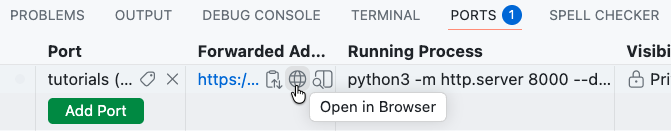

# Contributing to Vue3-WebDev-Kit

When working on tutorials and extensions in the Vue3-WebDev-Kit you will be working in a style that is typical of a contributor to an open source project. Each tutorial and each extension in the kit is given by a ticket in the issue tracker. You will solve the issue described in the ticket. These issues will have you build some artifacts as you follow along with tutorials and then extending them. You will submit your work by making a pull request for your feature branch.

## Contribution Workflow

The sections below outline how you can complete the different things that you will need to do while working on the tutorials and extensions in this kit. Clicking the &#9654; beside a step will expand the "Details" section, which will provide specific Git commands and other instructions that will be useful until you have used them enough to remember them. The &#9655; symbol indicates that the step does not have additional details and is included for formatting purposes.

### Starting a Tutorial

Use the following steps to start working on a new tutorial.

1. <a id="log-into-github-account"></a>
   <details>
   <summary>Log into your GitHub account.</summary>

   This link will take you to the [GitHub login page](https://github.com/login), if you are not already logged in. If you are logged in it will take you to your personal GitHub page.

   </details>

<p/>

2. <a id="open-your-codespace"></a>
   <details>
   <summary>Open your codespace.</summary>

   This link will take you to a page where you can [open your codespace](https://docs.github.com/en/codespaces/developing-in-a-codespace/opening-an-existing-codespace#opening-an-existing-codespace-from-the-your-codespaces-page), if it is not already open.

   When the codespace is ready the following message will appear in the terminal:

   ```bash
   *****************************************
   The Vue3 WebDev Kit is now ready for use.
   *****************************************
   ```

   </details>

<p/>

3. <a id="synchronize-with-upstream"></a>
   <details>
   <summary>Synchronize your main branch with the upstream.</summary>

   Synchronizing your `main` branch ensures that you are beginning your new work from the most up to date version of the project.
   <br><br>
   Running the commands below in the terminal in your codespace is one way to synchronize your `main` branch.

   ```bash
   git switch main
   git pull --ff-only upstream main
   git push origin main
   ```

   </details>

<p/>

4. <a id="create-and-switch-to-feature-branch"></a>
   <details>
   <summary>Create and switch to a new feature branch.</summary>

   Running the commands below in the terminal in your codespace is one way to create and switch to a new feature branch.
   <br><br>
   **Note that you will want to change the branch name from `tutorial-01-html-css` when working on later tutorials.**

   ```bash
   git switch main
   git branch tutorial-01-html-css
   git switch tutorial-01-html-css
   ```

   </details>

<p/>

5. <a id="make-a-pull-request"></a>
   <details>
   <summary>Make a pull request for your feature branch.</summary>

   Even though you haven't done any work this is the right time to create the pull request that you'll use to turn in your work. Creating a pull request early lets the instructor know you are working and gives you a place to ask questions about your work.
   <br><br>
   Running the commands below in the terminal in your codespace creates an empty commit so that you can create your pull request.

   ```bash
   git commit --allow-empty -m "Tutorial 01 - HTML/CSS"
   git push origin tutorial-01-html-css
   ```

   Now [create a pull request](https://docs.github.com/en/pull-requests/collaborating-with-pull-requests/proposing-changes-to-your-work-with-pull-requests/creating-a-pull-request#creating-the-pull-request) for the `tutorial-01` branch.
   - **Be sure to check off the box for the topic that you are working on in this pull request.**

   Note that several things will happen automatically to your new pull request. Each of these things models something that often happens in open source projects.
   1. A _label_ will be added to your pull request that categorizes the types of changes that you are proposing. In the case of this kit, those labels indicate the tutorials and extensions that you are working on.
   2. Your pull request will be automatically converted to a _draft pull request_. This status indicates to your instructor that you are still working. Later you'll mark your pull request as "ready for review" to turn in your work.

   </details>

### Working on Tutorial Tasks

Use the following steps when working through a tutorial.

1. <details>
   <summary>Watch or read the tutorial all the way through once.</summary>

   The idea here is to get an overall picture of what language features are being used and what functionality they provide. Don't worry about catching all of the details on this first pass.

   </details>

<p/>

2. <details>
   <summary>Watch the tutorial step-by-step and build the artifact.</summary>

   For video tutorials, pause and rewind the video as frequently as necessary for you to follow along and add the code that is shown to your project.

   </details>

<p/>

3. <a id="view-work-in-browser"></a>
   <details>
   <summary>View your work in the browser.</summary>

   When you have created an HTML page or a Vue app you can use the following steps to open it the browser.

   1. Click "PORTS" tab in in the bottom center of the VS Code window, just below the editor you have been using to modify the code.

      

   2. Point at the link in the second column titled "Forwarded Address".

   3. Click on the small _globe icon_ that appears.

      

   4. Click the new tab named "Directory listing for /" that opened in your browser.

   5. Navigate to the page that you want to view in the directory structure (e.g. for tutorial 01 click `web-projects` and then `first-website`).

   6. Once your page is open in a browser tab, reloading the page will display the effect of any changes you make.

   </details>

<p/>

4. <a id="stage-and-commit"></a>
   <details>
   <summary>Stage and commit the changes to your feature branch regularly.</summary>

   You should stage and commit the changes at each logical breaking point in the tutorial (e.g. after adding a new UI element, or after implementing a piece of functionality). You should have multiple commits for each tutorial.

   Running the commands below in the terminal are one way to stage and commit your changes.

   ```bash
   git status
   git stage .
   git commit -m "descriptive commit message"
   git status
   ```

   If you had a co-author or used AI in creating the content of the commit you will need to [add appropriate attribution commit trailers](./docs/AttributionTrailers.md), for example:

   ```bash
   git status
   git stage .
   git commit -m "-m "descriptive commit message" \
       --trailer "Assisted-by: GPT-3.3-Codex"
   git status
   ```

   </details>

<p/>

5. <a id="ensure-commit-was-successful"></a>
   <details>
   <summary>Ensure that the commit was successful.</summary>

   When making a commit, a number of checks are performed on the changes being committed. These checks ensure that the changes are properly formatted, use good style, and do not contain broken links or spelling errors.
   <br><br>
   **If any of the checks fail the commit will not be made.**
   <br><br>
   If the commit is not made, error information will be displayed in the terminal. Read the error messages that are displayed and try your commit again as described in step b.

   </details>

<p/>

6. <a id="push-feature-branch"></a>
   <details>
   <summary>Push your feature branch to your fork (i.e. your origin).</summary>

   Running the commands below in the terminal are one way to do this.

   ```bash
   git push origin tutorial-01-html-css
   ```

   Pushing your feature branch to GitHub **automatically updates your pull request for the branch.**

   </details>

<p/>

7. &#9655; Repeat steps 2-6 until you have completed the tutorial.

<p/>

### Completing a Tutorial

1. <a id="check-pull-request-changes"></a>
      <details>
      <summary>Verify that your pull request contains the desired changes.</summary>

   Visit this page for instructions on how to [view the changes in your pull request](https://docs.github.com/en/pull-requests/collaborating-with-pull-requests/proposing-changes-to-your-work-with-pull-requests/about-comparing-branches-in-pull-requests).
      </details>
   <p/>

2. <a id="mark-pull-request-ready"></a>
   <details>
   <summary>Mark your pull request as "Ready for Review."</summary>

   Because you made a pull request for your feature branch already, all that is necessary to submit your work is to mark your pull request as ready for review.

   Visit this page for instructions on how to [mark a pull request as ready for review](https://docs.github.com/en/pull-requests/collaborating-with-pull-requests/proposing-changes-to-your-work-with-pull-requests/changing-the-stage-of-a-pull-request#marking-a-pull-request-as-ready-for-review).

   </details>

### Pausing your Work

When you want to pause your work you should:

1. [Stage and commit](#stage-and-commit) any changes to your feature branch.

<p/>

2. [Push your feature branch](#push-feature-branch) to your fork (i.e. your origin).

<p/>

3. <details>
   <summary>Stop your codespace.</summary>

   Visit this page for instructions on how to [Stop your Codespace](https://docs.github.com/en/codespaces/developing-in-a-codespace/stopping-and-starting-a-codespace#stopping-a-codespace).

   </details>

### Resuming your Work

When you want to restart your work you should:

1. [Log into your GitHub account](#log-into-github-account), if you are not already logged in.

<p/>

2. [Open your codespace](#open-your-codespace).

### Starting an Extension

Starting an extension is very similar to starting a tutorial.

1. [Log into your GitHub account](#log-into-github-account).

<p/>

2. [Open your codespace](#open-your-codespace).

<p/>

3. <details>
   <summary>Create and switch to a new feature branch.</summary>

   When working on an extension you will create your new feature branch not from `main` but from your feature branch for the tutorial.

   Running the commands below in the terminal in your codespace is one way to create and switch to a new feature branch.
   <br><br>
   **Note that you will want to change the branch names from `tutorial-01-html-css` and `extension-01-html-css` when working on later extensions.**

   ```bash
   git switch tutorial-01-html-css
   git branch extension-01-html-css
   git switch extension-01-html-css
   ```

   </details>

<p/>

4. [Make a pull request](#make-a-pull-request) for your feature branch.

### Working on Extension Tasks

Working on the extension tasks is very similar to working on the tutorial tasks.

1. Complete the tasks in the extension in the order they are given.

<p/>

2. [View your work in the browser](#view-work-in-browser).

<p/>

3. [Stage and commit your changes](#stage-and-commit) at least once for each task.

<p/>

4. [Ensure that the commit was successful](#ensure-commit-was-successful).

<p/>

5. [Push your feature branch](#push-feature-branch) to GitHub.

### Completing an Extension

1. [Verify the changes in your pull request](#check-pull-request-changes).

<p/>

2. <details>
   <summary>Request a Copilot Review of your Pull Request</summary>

   Visit this page to learn how to [request a pull request review by Copilot](https://docs.github.com/en/copilot/how-tos/use-copilot-agents/request-a-code-review/use-code-review#using-copilot-code-review).

   </details>

<p/>

3. <details> 
   <summary>Address the comments in Copilot's pull request review.</summary>

   Visit this page for information on [finding Copilot's review of your pull request](https://docs.github.com/en/pull-requests/collaborating-with-pull-requests/reviewing-changes-in-pull-requests/viewing-a-pull-request-review).

   You should address each comment made by Copilot in its review. You might address a comment by:
   - Making or adapting the change that Copilot suggests and committing it to your feature branch.
   - Responding to Copilot's comment indicating why you do not think the change is appropriate.
   - Ensure that all of Copilot's comments have been marked as resolved.
   </details>

<p/>

4. [Mark your pull request as ready for review](#mark-pull-request-ready).
